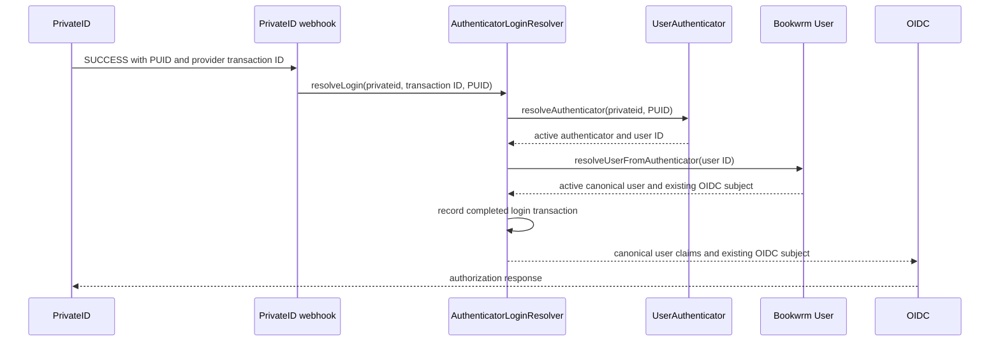

# Face Login Resolution

Face authentication resolves a pre-existing Bookwrm user. It never creates a user, OIDC subject, or identity record.

Unknown PUIDs fail authentication. Revoked authenticators return `Authenticator Revoked`. Inactive users cannot log in. Claims, organizations, subscriptions, and permissions remain attributes of the canonical Bookwrm user and are never read from the PrivateID webhook.