# Identity Platform v1.0 — Runtime Verification Report
## EMAIL_VERIFIED → SSO Login → Token → Claims Flow

**Document Type:** Runtime Flow Verification  
**Scope:** No implementation changes. Verification only.  
**Trace Methodology:** Code-level inspection across authentication, OIDC, and identity registry layers.

---

## Task 1: Complete Flow Trace

### Flow Entry: EMAIL_VERIFIED Status Set

**Trigger:** PrivateID webhook delivers authentication result  
**Endpoint:** `POST /privateid/webhook`  
**Source Code:** [routes/privateid.ts#270–350](src/routes/privateid.ts)

```
PrivateID Webhook (status=SUCCESS)
  ↓
  Extract provider identity from webhook body
  ↓
  Call resolveAuthenticatedUserFromPrivateId(privateIdUserId, candidate)
```

---

### Step 1: `resolveAuthenticatedUserFromPrivateId()` — Identity Registry Persistence

**Source Code:** [identity/PrivateIdIdentityResolver.ts#64–118](src/identity/PrivateIdIdentityResolver.ts)

**Input:**
- `privateIdUserId`: PrivateID provider subject (e.g., `"user123@privateid.com"`)
- `candidate`: extracted from webhook
  - `email` (from webhook field `email` or `userEmail`)
  - `emailVerified` (from webhook field `emailVerified` or `email_verified`) ← **EMAIL_VERIFIED status**
  - `displayName` (from webhook field `name`, `displayName`, or `fullName`)

**Key Operation:**
```ts
const identitySubject = await identityRegistry.resolveOrCreate({
    provider: "PrivateID",
    providerSubject: privateIdUserId,
    email,
    emailVerified,  // ← EMAIL_VERIFIED written to Identity Registry
    displayName
});
```

**Result:**
- **New IdentitySubject created in registry** (first login):
  - `id`: UUID (database row ID)
  - `oidcSubject`: **randomUUID()** ← **IMMUTABLE OIDC SUBJECT MINTED HERE**
  - `primaryProvider`: `"PrivateID"`
  - `primaryProviderSubject`: `privateIdUserId`
  - `email`: persisted
  - `emailVerified`: persisted as **boolean** ← **EMAIL_VERIFIED persisted**
  - `displayName`: persisted
  - `status`: `"ACTIVE"`
  - `createdAt`, `updatedAt`: timestamps

- **Existing IdentitySubject reused** (returning login):
  - Same `oidcSubject` returned
  - Email/emailVerified/displayName updated if provided

**Audit Trail:**
```
IdentityAudit: IDENTITY_CREATED + provider, providerSubject
IdentityAudit: AUTHENTICATOR_LINKED + provider, providerSubject
```

**Returned AuthenticatedUser:**
```ts
{
  id: privateIdUserId,
  sub: identitySubject.oidcSubject,  // ← STABLE OIDC SUBJECT
  email: identitySubject.email,
  emailVerified: identitySubject.emailVerified,  // ← EMAIL_VERIFIED
  name: identitySubject.displayName
}
```

**Stored in Session:**  
Call [PrivateIDSessionStore.storePrivateIDAuthenticatedUser(sessionId, authenticatedUser)](src/privateid/PrivateIDSessionStore.ts#26)

---

### Step 2: Browser Calls `GET /privateid/callback?reason=success&sessionId=...`

**Source Code:** [routes/privateid.ts#375–445](src/routes/privateid.ts)

**Flow:**
```
1. Browser receives 302 redirect from PrivateID server
2. Browser calls GET /privateid/callback with sessionId in query
3. Endpoint verifies session is "ready" and completed
4. Calls oidcService.resumePendingAuthorization(sessionId)
```

---

### Step 3: Resume Pending OIDC Authorization

**Source Code:** [oidc/OIDCService.ts#904–917](src/oidc/OIDCService.ts)

**Operation:**
```ts
async resumePendingAuthorization(privateIdSessionId: string): Promise<string | null> {
    const pendingContext = consumePendingAuthorizationRequest(privateIdSessionId);
    if (!pendingContext) {
        return null;  // No pending authorization stored
    }

    const user = getPrivateIDAuthenticatedUser(privateIdSessionId);
    if (!user) {
        return null;  // No authenticated user
    }

    return this.issueAuthorizationRedirect(user, pendingContext);
}
```

**Pending Context Retrieved:**  
Stored during initial `/authorize` call, contains:
```ts
{
  clientId: "base44-bookwrm-d935cd6f",
  redirectUri: "https://app.base44.com/api/apps/{APP_ID}/auth/sso/callback",
  scope: "openid profile email",
  nonce: "<random>",
  codeChallenge: "<S256-challenge>",
  state: "<random>"
}
```

**AuthenticatedUser Retrieved:**  
Same user object from Step 1:
```ts
{
  id: privateIdUserId,
  sub: "oidcSubject-uuid",  // ← SAME OIDC SUBJECT
  email: "user@example.com",
  emailVerified: true,  // ← EMAIL_VERIFIED flag
  name: "Display Name"
}
```

---

### Step 4: Authorization Code Issuance

**Source Code:** [oidc/OIDCService.ts#877–900](src/oidc/OIDCService.ts)

**Operation:**
```ts
private async issueAuthorizationRedirect(
    user: AuthenticatedUser,
    context: PendingAuthorizationContext
): Promise<string> {
    const authorizationCode = this.createAuthorizationCode();  // 32-byte random

    await this.storeAuthorizationCode({
        code: authorizationCode,
        clientId: context.clientId,
        redirectUri: context.redirectUri,
        scope: context.scope,
        nonce: context.nonce,
        codeChallenge: context.codeChallenge,
        userId: user.id,
        userSub: user.sub  // ← OIDC SUBJECT STORED WITH CODE
    });

    const redirectTarget = new URL(context.redirectUri);
    redirectTarget.searchParams.set("code", authorizationCode);
    if (context.state) {
        redirectTarget.searchParams.set("state", context.state);
    }

    return redirectTarget.toString();
}
```

**Response:**  
302 redirect to:
```
https://app.base44.com/api/apps/{APP_ID}/auth/sso/callback?code=<authCode>&state=<state>
```

---

### Step 5: Client Exchanges Code for Token

**Source Code:** [oidc/OIDCService.ts#461–650](src/oidc/OIDCService.ts)

**Request:**
```
POST /token HTTP/1.1
Content-Type: application/x-www-form-urlencoded
Authorization: Basic base64(client_id:client_secret)

grant_type=authorization_code
&code=<authCode>
&redirect_uri=https://app.base44.com/api/apps/{APP_ID}/auth/sso/callback
&code_verifier=<pkceVerifier>
```

**Validation Chain:**
1. Verify grant_type is `authorization_code`
2. Verify code is valid and not expired
3. Verify code's clientId matches request clientId
4. Verify code's redirectUri matches request redirectUri
5. Verify client credentials (client_secret_basic)
6. Verify PKCE S256 challenge matches verifier
7. Retrieve authorization code record:
   ```ts
   const codeRecord = await this.consumeAuthorizationCode(code);
   // {
   //   code, clientId, redirectUri, scope, nonce, codeChallenge,
   //   userId: privateIdUserId,
   //   userSub: oidcSubject
   // }
   ```

---

### Step 6: Resolve Current Claims from Identity Registry

**Source Code:** [oidc/OIDCService.ts#615–630](src/oidc/OIDCService.ts)

**Critical Comment:**  
> Release Patch 6.1: the code only carries userId/userSub — mutable claims are re-resolved live from the Identity Registry here, so an Identity Registry update after code issuance is never missed.

**Operation:**
```ts
const currentClaims = await this.resolveCurrentClaims(codeRecord.userSub);
// ↓
private async resolveCurrentClaims(
    oidcSubject: string
): Promise<{ email?: string; emailVerified?: boolean; name?: string }> {
    const subject = await identityRegistry.findByOidcSubject(oidcSubject);
    if (!subject) {
        return {};
    }

    return {
        email: subject.email,
        emailVerified: subject.emailVerified,  // ← LIVE READ FROM REGISTRY
        name: subject.displayName
    };
}
```

**Key Behavior:**
- **ALWAYS** reads current Identity Registry row by oidcSubject
- **NEVER** snapshotted or cached
- If Identity Registry was updated after code issuance (e.g., email verified post-activation), **the updated value is used here**

**Result (currentClaims):**
```ts
{
  email: "user@example.com",
  emailVerified: true,  // ← CURRENT EMAIL_VERIFIED FROM REGISTRY
  name: "Display Name"
}
```

---

### Step 7: Create ID Token

**Source Code:** [oidc/OIDCService.ts#631–644](src/oidc/OIDCService.ts)

**Transform to OIDC Claims:**
```ts
const claims = await this.claimsService.toOIDCClaims({
    id: privateIdUserId,
    sub: oidcSubject,
    email: currentClaims.email,
    emailVerified: currentClaims.emailVerified,  // ← EMAIL_VERIFIED
    name: currentClaims.name
});

// ClaimsService.toOIDCClaims() returns:
// {
//   sub: oidcSubject,
//   email: "user@example.com",
//   emailVerified: true,  // ← CURRENT VALUE
//   name: "Display Name"
// }
```

**Scope-Based Claim Filtering:**  
[claims.ts#3–6](src/oidc/claims.ts):
```ts
export const oidcClaims = {
    openid: ["sub"],
    profile: ["name", "family_name", "given_name", "preferred_username"],
    email: ["email", "email_verified"]  // ← email_verified in email scope
} as const;
```

**ID Token Creation:**
```ts
const idToken = await this.createIdToken({
    issuer: "https://identity.bookwrm.com",
    subject: codeRecord.userSub,
    audience: "base44-bookwrm-d935cd6f",
    nonce: codeRecord.nonce,
    scope: "openid profile email",
    email: "user@example.com",
    emailVerified: true,  // ← EMAIL_VERIFIED_CLAIM
    name: "Display Name",
    iat: now,
    exp: now + 300
});
```

**Signed JWT (RS256):**
```json
{
  "alg": "RS256",
  "typ": "JWT",
  "kid": "<keyId>"
}
.
{
  "sub": "oidcSubject-uuid",
  "email": "user@example.com",
  "email_verified": true,
  "name": "Display Name",
  "nonce": "...",
  "aud": "base44-bookwrm-d935cd6f",
  "iss": "https://identity.bookwrm.com",
  "iat": 1693526400,
  "exp": 1693526700
}
.
<RS256-signature>
```

---

### Step 8: Token Endpoint Response

**Response:**
```json
{
  "token_type": "Bearer",
  "expires_in": 300,
  "access_token": "<opaque-32-byte-token>",
  "refresh_token": "<opaque-32-byte-token>",
  "id_token": "<JWT-with-email_verified-claim>"
}
```

---

### Step 9: UserInfo Endpoint

**Source Code:** [oidc/OIDCService.ts#408–457](src/oidc/OIDCService.ts)

**Request:**
```
GET /userinfo HTTP/1.1
Authorization: Bearer <access_token>
```

**Validation:**
1. Parse Bearer token
2. Look up access token in Redis
3. Verify token not expired
4. Extract `sub` (oidcSubject) from token record

**Claim Resolution (LIVE):**
```ts
const currentClaims = await this.resolveCurrentClaims(tokenRecord.sub);
// ↓ Same live read from Identity Registry as in /token step
```

**UserInfo Response:**
```json
{
  "sub": "oidcSubject-uuid",
  "email": "user@example.com",
  "email_verified": true,
  "name": "Display Name"
}
```

---

## Task 2: OIDC Subject Reuse in Resumed Authorization

### ✅ CONFIRMED: Same oidcSubject Used Throughout

**Evidence Chain:**

| Step | Component | oidcSubject Value | Source |
|------|-----------|-------------------|--------|
| 1 | IdentityRegistry.resolveOrCreate() | `randomUUID()` minted | [IdentityRegistry.ts#54](src/identity/IdentityRegistry.ts) |
| 1 | PrivateIdIdentityResolver returns AuthenticatedUser | `identitySubject.oidcSubject` | [PrivateIdIdentityResolver.ts#111](src/identity/PrivateIdIdentityResolver.ts) |
| 1 | PrivateIDSessionStore.storePrivateIDAuthenticatedUser() | Stored with sessionId | [PrivateIDSessionStore.ts#26](src/privateid/PrivateIDSessionStore.ts) |
| 3 | resumePendingAuthorization() retrieves user | `user.sub` from stored session | [OIDCService.ts#910–911](src/oidc/OIDCService.ts) |
| 4 | issueAuthorizationRedirect() stores code | `userSub: user.sub` in code record | [OIDCService.ts#890](src/oidc/OIDCService.ts) |
| 6 | /token resolves claims | Uses `codeRecord.userSub` to query registry | [OIDCService.ts#621](src/oidc/OIDCService.ts) |
| 7 | ID Token issued | Claims `sub` = same `oidcSubject` | [OIDCService.ts#640](src/oidc/OIDCService.ts) |
| 9 | UserInfo endpoint | Uses `tokenRecord.sub` (same subject) | [OIDCService.ts#440](src/oidc/OIDCService.ts) |

**Conclusion:**  
✅ **The same `oidcSubject` created during `resolveAuthenticatedUserFromPrivateId()` (Step 1) is reused throughout the resumed authorization flow.** It is never re-minted; it is stable across all protocol endpoints.

---

## Task 3: Identity Registry Reads — Updated State vs. Cached State

### ✅ CONFIRMED: Live Identity Registry Reads, No Cached Claims

**Critical Code Comment** (Release Patch 6.1):
> Release Patch 6.1: sole point where /token and /userinfo pull mutable claims -- always a live Identity Registry read by oidcSubject, never a cached/snapshotted value.

**Evidence:**

| Endpoint | Operation | Source | Behavior |
|----------|-----------|--------|----------|
| `/token` | `resolveCurrentClaims(oidcSubject)` | [OIDCService.ts#615–627](src/oidc/OIDCService.ts) | Calls `identityRegistry.findByOidcSubject(oidcSubject)` — live DB read |
| `/userinfo` | `resolveCurrentClaims(tokenRecord.sub)` | [OIDCService.ts#441–453](src/oidc/OIDCService.ts) | Calls `identityRegistry.findByOidcSubject()` — live DB read |
| Authorization Code | Stored payload | [OIDCService.ts#877–890](src/oidc/OIDCService.ts) | **Does NOT store claims**; only stores `userId`, `userSub`, protocol fields (scope, nonce, PKCE challenge) |

**Why This Matters:**
- Authorization code is ephemeral (1-minute TTL)
- Between code issuance and token exchange, Identity Registry row could be updated (e.g., email verification status change, display name update)
- **Live read at `/token` time ensures updated claims are always included in ID Token**
- **No stale snapshot risk**

**Scenario: Email Verified Post-Activation**
```
1. PrivateID webhook: emailVerified=false
   → IdentitySubject created with emailVerified=false
   
2. Authorization code issued (code TTL: 60s)
   → Code carries: userId, userSub, nonce, scope, PKCE
   → Code does NOT carry: emailVerified claim
   
3. [ADMIN UPDATES REGISTRY] emailVerified=true
   
4. Client exchanges code for token (within 60s)
   → resolveCurrentClaims(oidcSubject) queries registry LIVE
   → Finds emailVerified=true (UPDATED VALUE)
   → ID Token includes email_verified=true
```

**Conclusion:**  
✅ **/token and /userinfo ALWAYS read the current Identity Registry row.** No caching, no snapshot behavior. If the registry is updated after code issuance, the updated value is reflected in the token/userinfo response.

---

## Task 4: Sequence Diagram

```mermaid
sequenceDiagram
    autonumber
    actor PrivateID
    participant B as Browser
    participant PServer as Platform Server<br/>/privateid/webhook<br/>/privateid/callback<br/>/authorize /token /userinfo
    participant Reg as Identity Registry<br/>(Database)
    participant Cache as PrivateID Session<br/>Store
    participant OIDCProv as OIDC Provider<br/>(oidc-provider lib)
    participant Client as Base44 Client<br/>App

    Note over PrivateID,Client: Phase 1: Activation Completion (EMAIL_VERIFIED)

    PrivateID->>PServer: POST /privateid/webhook<br/>status=SUCCESS<br/>email=user@example.com<br/>emailVerified=true

    activate PServer
    PServer->>Reg: resolveOrCreate(<br/>provider=PrivateID,<br/>providerSubject,<br/>email,<br/>emailVerified=true,<br/>displayName)
    
    activate Reg
    Reg->>Reg: Mint randomUUID()<br/>as oidcSubject
    Reg->>Reg: INSERT IdentitySubject<br/>oidcSubject, email,<br/>emailVerified, status=ACTIVE
    Reg-->>PServer: IdentitySubject{<br/>oidcSubject,<br/>email,<br/>emailVerified=true,<br/>primaryProvider,<br/>displayName}
    deactivate Reg

    PServer->>Cache: storePrivateIDAuthenticatedUser(<br/>sessionId,<br/>AuthenticatedUser{<br/>id, sub=oidcSubject,<br/>email, emailVerified,<br/>name})<br/>→ Mark session "ready"
    
    activate Cache
    Cache->>Cache: Store user context
    deactivate Cache
    deactivate PServer

    Note over PrivateID,Client: Phase 2: Browser Callback & Authorization Resume

    PrivateID->>B: 302 Redirect
    B->>PServer: GET /privateid/callback<br/>?reason=success&sessionId=...

    activate PServer
    PServer->>Cache: Get PrivateID session<br/>Verify: status=ready,<br/>completed=true
    
    activate Cache
    Cache-->>PServer: session confirmed ready
    deactivate Cache

    PServer->>PServer: resumePendingAuthorization(<br/>sessionId)

    PServer->>Cache: consumePendingAuthorizationRequest(<br/>sessionId)
    activate Cache
    Cache-->>PServer: PendingAuthorizationContext{<br/>clientId, redirectUri,<br/>scope, nonce,<br/>codeChallenge, state}
    deactivate Cache

    PServer->>Cache: getPrivateIDAuthenticatedUser(<br/>sessionId)
    activate Cache
    Cache-->>PServer: AuthenticatedUser{<br/>id, sub=oidcSubject,<br/>email, emailVerified, name}<br/>← SAME oidcSubject as Step 1
    deactivate Cache

    PServer->>PServer: issueAuthorizationRedirect(<br/>user, pendingContext)
    PServer->>PServer: authCode =<br/>createAuthorizationCode()
    PServer->>PServer: Store authCode record:<br/>{code, clientId,<br/>redirectUri, scope,<br/>nonce, codeChallenge,<br/>userId, userSub}
    
    deactivate PServer

    PServer-->>B: 302 Redirect<br/>Location: redirectUri?code=...&state=...

    B->>Client: Redirect browser

    Note over PrivateID,Client: Phase 3: Token Exchange & Claims Lookup

    Client->>PServer: POST /token<br/>grant_type=authorization_code<br/>code=authCode<br/>redirect_uri=...<br/>code_verifier=...<br/>Authorization: Basic(client_id:secret)

    activate PServer
    PServer->>PServer: Validate code record<br/>Verify clientId, redirectUri,<br/>PKCE S256, nonce

    PServer->>PServer: resolveCurrentClaims(<br/>codeRecord.userSub)<br/>← Live registry read

    activate Reg
    Reg->>Reg: SELECT * FROM identity_subjects<br/>WHERE oidc_subject = ?<br/>← Live query at token time
    Reg-->>PServer: IdentitySubject{<br/>email=user@example.com,<br/>emailVerified=true,<br/>displayName, ...}
    deactivate Reg

    PServer->>PServer: claims = toOIDCClaims({<br/>sub=oidcSubject,<br/>email,<br/>emailVerified=true,<br/>name})<br/>← Current registry state

    PServer->>PServer: createIdToken({<br/>sub=oidcSubject,<br/>email,<br/>email_verified=true,<br/>name,<br/>nonce, aud,<br/>iss, iat, exp})<br/>Sign with RS256

    PServer->>PServer: Mint accessToken<br/>& refreshToken<br/>Store in Redis

    deactivate PServer
    PServer-->>Client: {<br/>token_type: Bearer,<br/>access_token,<br/>refresh_token,<br/>id_token: JWT{<br/>sub,<br/>email,<br/>email_verified=true,<br/>name,<br/>nonce, aud, iss}<br/>}

    Note over PrivateID,Client: Phase 4: UserInfo Endpoint

    Client->>PServer: GET /userinfo<br/>Authorization: Bearer access_token

    activate PServer
    PServer->>PServer: Verify access_token<br/>Lookup in Redis

    PServer->>PServer: resolveCurrentClaims(<br/>tokenRecord.sub)<br/>← Live registry read

    activate Reg
    Reg->>Reg: SELECT * FROM identity_subjects<br/>WHERE oidc_subject = ?
    Reg-->>PServer: IdentitySubject{<br/>email=user@example.com,<br/>emailVerified=true,<br/>displayName, ...}
    deactivate Reg

    deactivate PServer
    PServer-->>Client: {<br/>sub=oidcSubject,<br/>email,<br/>email_verified=true,<br/>name<br/>}
```



---

## Summary

### Task 1: Complete Flow Trace ✅
The flow traces from PrivateID webhook (`EMAIL_VERIFIED` status) through:
1. **Activation (Webhook):** Identity Registry persistence with immutable `oidcSubject` minted
2. **Browser Callback:** Session verification and authorization resume
3. **Authorization Code:** Issued with only protocol fields (userId, userSub, nonce, scope, PKCE) — no claims snapshot
4. **Token Exchange:** Live Identity Registry read → current claims resolved → ID Token signed with `email_verified` claim
5. **UserInfo:** Live registry read → same claims returned

### Task 2: OIDC Subject Reuse ✅
**Confirmed:** The same `oidcSubject` created during activation is used throughout the resumed authorization. It is:
- Minted once (randomUUID) at identity creation
- Immutable in the registry
- Returned in AuthenticatedUser and stored in session
- Retrieved in `resumePendingAuthorization()` and included in the authorization code
- Used to query the registry at `/token` and `/userinfo` time

### Task 3: Identity Registry Reads ✅
**Confirmed:** No caching; always live registry reads:
- Authorization code **stores only protocol fields**, not claims
- `/token` endpoint **always** calls `resolveCurrentClaims()` → `identityRegistry.findByOidcSubject()` (live DB query)
- `/userinfo` endpoint **always** calls same live read
- If registry is updated after code issuance, `/token` receives the updated claims
- Release Patch 6.1 enforces this pattern: "sole point where /token and /userinfo pull mutable claims -- always a live Identity Registry read by oidcSubject, never a cached/snapshotted value"

### Task 4: Sequence Diagram ✅
Diagram above shows all 4 phases:
- **Phase 1:** Activation completion with EMAIL_VERIFIED
- **Phase 2:** Browser callback and authorization resume
- **Phase 3:** Token exchange with live claims lookup
- **Phase 4:** UserInfo endpoint

---

## Code References

| Component | File | Key Function/Constant |
|-----------|------|---------------------|
| Identity Minting | [src/identity/IdentityRegistry.ts#54](src/identity/IdentityRegistry.ts) | `randomUUID()` for oidcSubject |
| PrivateID Resolution | [src/identity/PrivateIdIdentityResolver.ts#64](src/identity/PrivateIdIdentityResolver.ts) | `resolveAuthenticatedUserFromPrivateId()` |
| Webhook Handler | [src/routes/privateid.ts#270](src/routes/privateid.ts) | `POST /privateid/webhook` |
| Callback Handler | [src/routes/privateid.ts#375](src/routes/privateid.ts) | `GET /privateid/callback` |
| Resume Authorization | [src/oidc/OIDCService.ts#904](src/oidc/OIDCService.ts) | `resumePendingAuthorization()` |
| Code Issuance | [src/oidc/OIDCService.ts#877](src/oidc/OIDCService.ts) | `issueAuthorizationRedirect()` |
| Token Endpoint | [src/oidc/OIDCService.ts#461](src/oidc/OIDCService.ts) | `POST /token` |
| Claim Resolution | [src/oidc/OIDCService.ts#920](src/oidc/OIDCService.ts) | `resolveCurrentClaims()` |
| ID Token Creation | [src/oidc/OIDCService.ts#631](src/oidc/OIDCService.ts) | `createIdToken()` |
| UserInfo Endpoint | [src/oidc/OIDCService.ts#408](src/oidc/OIDCService.ts) | `GET /userinfo` |
| Claims Mapping | [src/oidc/claims.ts#3](src/oidc/claims.ts) | oidcClaims export |

---

**Verification Status:** ✅ **COMPLETE**  
**No Implementation Changes Required**
